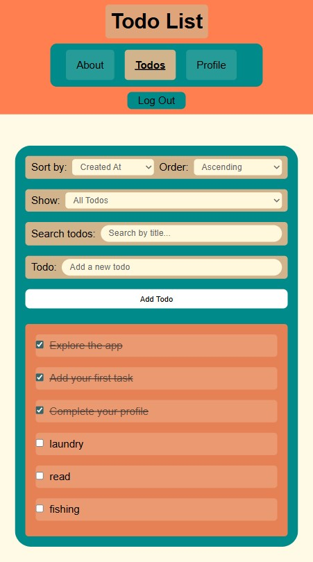
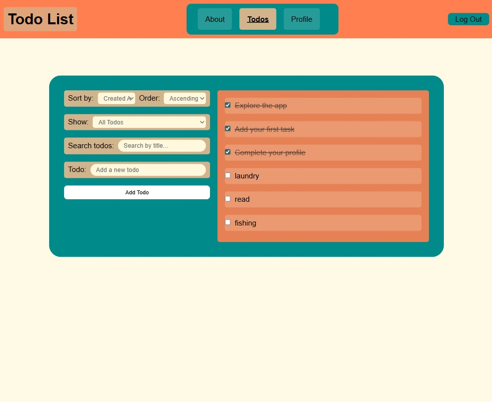

# Todo List

A React application for managing todos, designed with a responsive, mobile-first interface. Users can create, update, complete, and delete tasks. The app also offers sorting and filtering features to help organize and find todos.

## Live Demo Link

[todo-list-delta-ashen-20.vercel.app](http://todo-list-delta-ashen-20.vercel.app/)

## Features

- Add todos to a list
- Edit or delete todos
- Mark todos as 'complete'
- Sort todo list by title or created at date
- Filter todos by keyword

## Technologies Used

- **Front End:** React 19, React Router, CSS Modules
- **State Management:** useReducer, Context API
- **Build Tool:** Vite
- **Deployment:** Vercel

## Screenshots

## Getting Started(Installation and setup)

1. Clone the repository to your machine locally.
2. Install project dependencies by running the command: `npm install`
3. Start the development server by running the command: `npm run dev`
4. Open a web browser and navigate to http://localhost:3001

## Available Scripts

- `npm run dev`: starts the development server

- `npm run build`: bundles the app for production

- `npm run preview`: provides a local version of the production build

- `npm run lint`: runs ESLint to monitor code quality

## Design Decisions

I used a mobile first, responsive design approach. I used semantic HTML for a clear structure, maintaining an intuitive layout. Some of the accessibility considerations that guided design choices include visible focus states, clear disabled/loading states, keyboard friendly navigation, and proper label/input pairing.

## Future Improvement Ideas

- Extract editing/updating todo logic into a custom hook
- Optional todo details: each todo can have an expandable notes section for longer descriptions or extra info
- Light/Dark mode toggle
- Ability to reorder tasks
- Implement data persistence
- Implement todo priority levels: mark todos as high/medium/low

## License Information

This project is licensed under the MIT license.

## Contact Information

https://github.com/cryssw17
